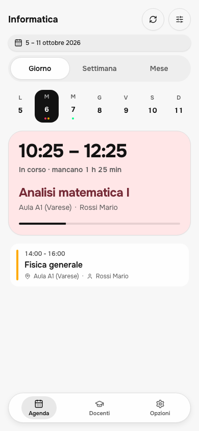
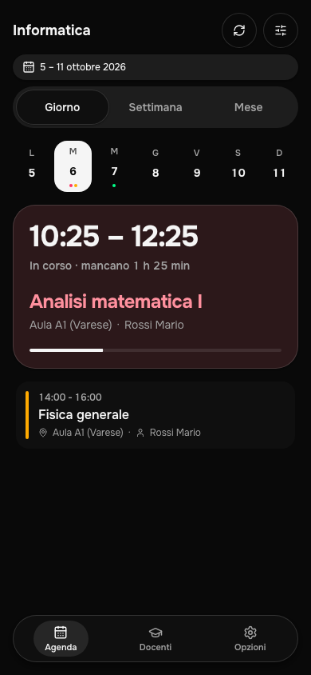
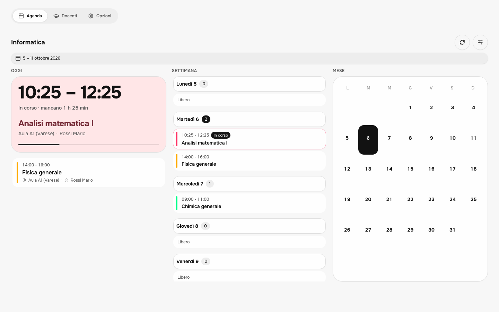
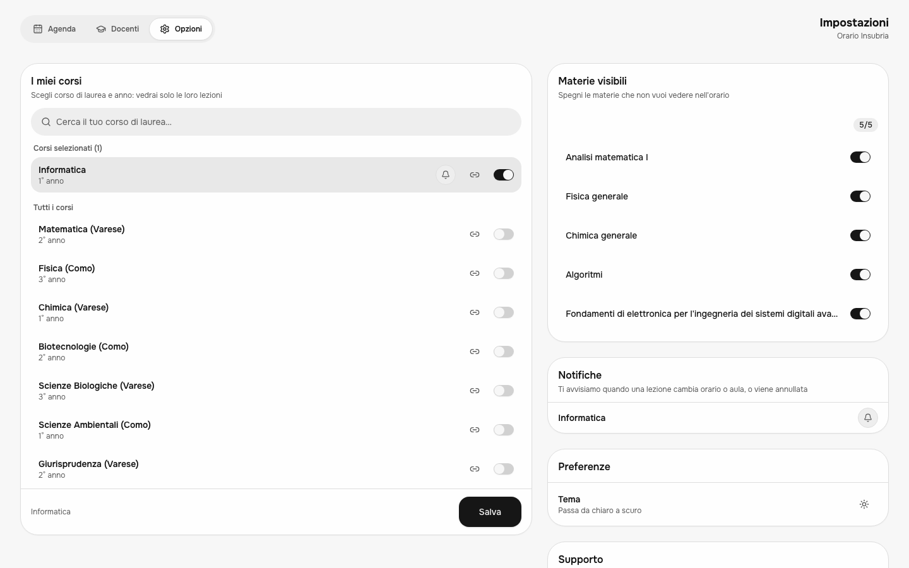

# UniOrario

L'orario dell'Università dell'Insubria, pensato per essere letto in piedi nel corridoio: la prossima lezione, l'aula, il docente, e poco altro.

È un progetto personale, non ufficiale e non affiliato all'ateneo.

<p align="center">
  
  &nbsp;
  
</p>

<p align="center">
  
</p>

<p align="center">
  
</p>

Gli screenshot usano dati di esempio.

## Come ragiona

**L'orario è già pubblico, ma scomodo.** Ogni corso e ogni anno ha un calendario pubblico su Cineca UniversityPlanner. UniOrario li legge, li ripulisce (nomi delle materie, aule, docenti, lezioni in videoconferenza) e mostra al centro la lezione che conta adesso: orario di inizio e fine in grande, quanto manca, dove e con chi.

**Niente account.** Gli studenti non si registrano: il server assegna un cookie anonimo e le preferenze stanno sul dispositivo. L'unico login è quello dell'amministratore.

**I cambi di orario arrivano da soli.** Ogni 20 minuti un job rilegge i calendari dei corsi per cui qualcuno ha attivato le notifiche e li confronta con l'ultima copia salvata. Se una lezione cambia orario o aula, o viene annullata, chi ha attivato le notifiche per quel corso riceve un avviso con il prima e il dopo. Le modifiche già avvenute prima che tu scegliessi il corso non ti vengono mostrate.

**Su desktop usa tutto lo spazio.** Oggi, settimana e mese stanno affiancati; le impostazioni diventano una pagina a due colonne invece di una lista verticale. Su telefono resta una colonna sola con la barra in basso.

Il resto è quello che ti aspetti: filtro delle materie da nascondere, ricerca dei docenti con l'aula in cui si trovano ora, tema chiaro e scuro, installazione come app.

## Provarlo in locale

Servono Node 20 o superiore e pnpm.

```bash
pnpm install
pnpm db:migrate
pnpm dev
```

L'app parte su http://localhost:3000. In sviluppo Next usa un database D1 locale in `.wrangler/`, quindi non tocca mai i dati di produzione.

Crea un file `.env.local` con queste variabili:

- `BETTER_AUTH_SECRET`: una stringa casuale lunga, firma le sessioni
- `BETTER_AUTH_URL`: l'indirizzo dell'app, in locale `http://localhost:3000`
- `CRON_SECRET`: protegge le chiamate dei job
- `VAPID_PRIVATE_KEY` e `NEXT_PUBLIC_VAPID_PUBLIC_KEY`: la coppia di chiavi per le notifiche push, che genera `npx web-push generate-vapid-keys`
- `NEXT_PUBLIC_ADMIN_EMAIL`: l'email dell'amministratore

Per riempire l'elenco dei corsi puoi lanciare `pnpm db:scrape-courses`. Gli altri comandi utili sono `pnpm lint`, `pnpm format` e `pnpm preview` (build per Cloudflare in anteprima).

## Com'è fatto

Next.js 16 con App Router, React 19 e TypeScript, interfaccia in Tailwind CSS 4 con framer-motion. I dati passano da tRPC con validazione zod e TanStack Query. Il database è Cloudflare D1 con Drizzle; il login dell'amministratore usa better-auth; le notifiche sono Web Push con un service worker. Il tutto gira su Cloudflare Workers tramite OpenNext, con un secondo Worker che esegue i job pianificati. Lint e formattazione con Biome.

```
app/                 pagine, API route, manifest
components/          agenda, home, impostazioni, docenti, admin, componenti base
lib/                 store, utilità, accesso al database, job (lib/jobs)
server/api/routers/  procedure tRPC: orario, corsi, notifiche, statistiche
cron-worker/         il Worker che lancia i job
drizzle/             migration di D1
public/              service worker, icone, header di sicurezza
```

I job sono tre: il controllo dei cambi di orario ogni 20 minuti, l'aggiornamento dell'elenco docenti ogni 6 ore e la lettura dell'elenco corsi dal sito dell'ateneo ogni domenica notte.

## Deploy

1. Crea il database D1 e metti il suo id in `wrangler.jsonc`.
2. Imposta i secret con `wrangler secret put` (gli stessi nomi di sopra; `CRON_SECRET` va impostato anche sul Worker dei cron, con `-c cron-worker/wrangler.jsonc`).
3. `pnpm db:migrate:remote` per le migration, poi `pnpm deploy` per l'app e `pnpm deploy:cron` per i job.

## Cosa manca

Gli appelli d'esame. Sono in ESSE3, che blocca ogni accesso automatico con una sfida Cloudflare e non espone una API pubblica per gli appelli. Sul branch `feature/esami` c'è una versione che usa i pochi esami pubblicati nei calendari Cineca; non è nella versione stabile.

## Licenza

Apache 2.0, vedi [LICENSE](LICENSE). Segnalazioni e idee: stefanomarocco0@gmail.com.
